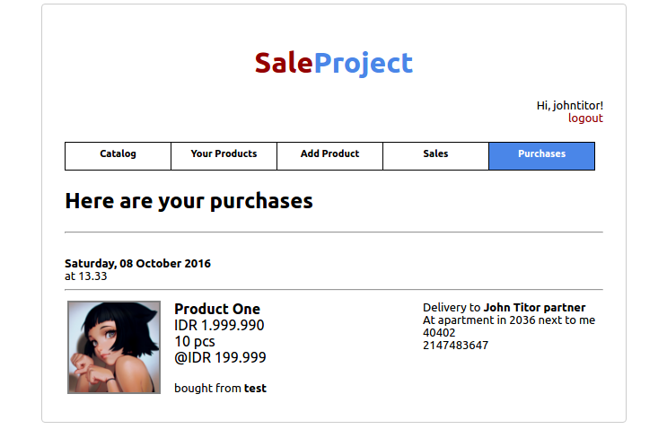

# Tugas 1 IF3110 Pengembangan Aplikasi Berbasis Web

Membuat Website Marketplace sederhana.

## Deskripsi Singkat

Sebuah Website Marketplace sederhana bernama SaleProject. SaleProject memiliki fitur minimum sebuah website marketplace yaitu login, register, catalog, pembelian produk, manajemen produk, histori penjualan, dan histori pembelian. SaleProject dikembangkan menggunakan teknologi PHP, CSS, dan JavaScript.

## Anggota Tim
1. Candra Ramsi (13514090)
2. Heri Fauzan (13513028)
3. Muhammad Ikhsan (13511064)

## Technology require for running this program

1. PHP 5
2. MySQL
3. A browser

## Spesifikasi

;
Pengalaman berbelanja dimulai dengan melakukan registrasi pada website.
Isi data sesuai label. Validasi akan dilakukan untuk tiap input.
Setelah terdaftar User akan diarahkan ke halaman Catalog.

Jika User sudah terdaftar maka User dapat memasukan username/email dan password untuk masuk ke halaman catalog.

Pada halaman catalog User dapat melihat seluruh produk dari seluruh User. Pencarian dengan keyword dapat dilakukan untuk menghemat waktu pencarian. Pencarian dapat dilakukan berdasarkan username maupun nama produk.

User juga dapat me-like sebuah produk ataupun membeli produk dari halaman ini. Produk yang sudah ter-like akan bertambah jumlah likenya sebanyak 1. Tentu saja User dapat membatalkan like dengan memencet tombol liked kembali. Jika User memutuskan untuk membeli produk, tombol buy akan membawa User ke halaman konfirmasi pembelian.

Pada halaman ini User akan mengisi detail dari pembelian yang ingin dilakukan. Setelah seluruh data terisi dan tombol confirm ditekan, Akan dikonfirmasi kembali. Jika User menyetujuinya, maka pembelian akan dilakukan dan User akan dibawa ke halaman Purchases.

Pada halaman ini seluruh pembelian User akan ditampilkan berserta detailnya. Informasi produk pada halaman ini adalah informasi produk saat User membeli dan tidak akan berubah biarpun penjual mengubah detail produk.

Pada halaman ini User dapat menambahkan produk untuk dijual. Form yang sama akan digunakan untuk melakukan penyuntingan detail produk.

Pada halaman ini User dapat melihat seluruh produk yang telah ia tambahkan. User dapat memenekan tombol EDIT atau DELETE. EDIT akan membawa User ke halaman Edit Product yang berisi seperti halaman add product namun telah diisikan detail saat ini. Delete akan menghapus produk. Tombol delete memberikan konfirmasi pada User sebelum penghapusan benar-benar dilakukan.

Pada halaman ini ditampilkan seluruh history penjualan User.

### Pembagian Tugas

**Tampilan**
1. Login : 13513028, 13514090
2. Register : 13513028, 13514090
3. Header : 13513028, 13514090
4. Catalog : 13514090
5. Confirmation Purchase : 13514090
6. Your Products : 13514090
7. Add Product : 13514090
8. Edit Product : 13514090
9. Sales : 13514090
10. Purchase : 13514090

**Fungsionalitas**
1. Login : 13514090
2. Register : 13513028, 13514090
3. Catalog : 13514090
4. Confirmation Purchase : 13514090
5. Your Products : 13514090
6. Add Product : 13514090
7. Edit Product : 13514090
8. Sales : 13514090
9. Purchase : 13514090

## About

Asisten IF3110 2016

Adin | Chairuni | David | Natan | Nilta | Tifani | Wawan | William

Dosen : Yudistira Dwi Wardhana | Riza Satria Perdana
